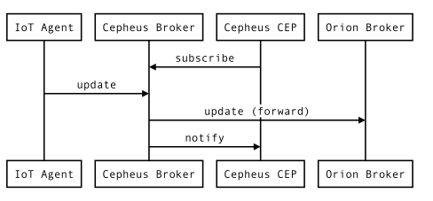

# Introduction

The Cepheus-broker component is a lightweight broker only supporting two kinds of operations:

- requests forwarding by keeping track of which components register Context Entities.
- pub/sub requests for Context Entities.

This keeps the implementation simple and sufficient for the use cases handled by the NGSI gateway.

The main goal of the Cepheus-Broker is to sit between the "south components" like IoT Agents or NGSI devices (actuators and sensors), forward their requests to a remote broker (e.g. a "north component" like Orion)
while allowing some other NGSI components (like the Cepheus-CEP) to subscribe to some the updated Context Elements.

# Forwarding support

Request forwarding is based on the fact that south components (like IoT Agents and NGSI devices) will register their Context Entities on startup.

The broker will track these `/registerContext` requests (keeping a list of all `providingApplication` URLs)
before forwarding them back to the remote broker.

Then when `/updateContext` or `/queryContext` requests arrive, they will be :
 - either forwarded to south components when a matching `providingApplication` URL is found.
 - else forwarded to the remote broker.

The forwarding process is described in the Fiware-Orion project documentation: [here](https://fiware-orion.readthedocs.org/en/develop/user/context_providers/index.html)

### Disable updateContext forward to the remote broker

In some complex scenarios, it might be useful to **hide** Context Entities updates emitted by "south components" like sensors from the remote broker
for privacy, latency or security reasons.

The forwarding of `updateContext` requests to the remote broker can be disabled
by setting `remote.forward.updateContext` to `false`
(see [admin guide](../admin/broker.md) for more details).

# Pubsub support

Publish/subscribe is supported by the `/subscribeContext` requests to Context Entities that will trigger `/notifyContext` requests.

This feature is mainly used by Cepheus-CEP to track updates to Context Entities.

The subscriptions are persisted in a Sqlite database.

# Limitations

The broker has many limitations due to its simple design compared to a complete broker implementation.

- Broker supports all NGGSI-10 standard and convenient operations from the NGSI v1 API except for the 'updateContextSubscriptions' operation.
- Broker only support the  NGSI-9 `registerContext` operation from the NGSI v1 API for request forwarding.
- Subscriptions only support `ONCHANGE` as type of notification of `notifyCondition`.
- Subscriptions do not support `throttling`, `restriction` or `condValues`.
- Subscriptions will send the whole set of updated context elements in the payload notification, there is no filtering.
- If multiple NGSI providers register the same Context Entities, only the first provider will get the forwarded `queryContext` or `updateContext` requests.
- When a `queryContext` or `updateContext` request contains references to multiple Context Entities, the request is forwarded only to the Context Provider of the first Context Entity.
- Broker does not keep the any value of Context Entities, all requests will get forwarded to a Context Provider or the remote Broker.
