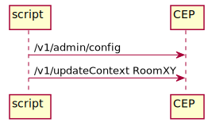

# Rooms and Floors example

Lets consider we have :
 - a set of temperature sensors accross multiple rooms
 - a set of flap sensors which control opening and closing windows shutters
 - multiple rooms over a set of Floors

We would like to update the closing to window shutter when the room temperature is > 25°

## Setup

We configure our NGSI compatible sensors to output their values as the following Context Entity:

     {
         "id": "Room31", // Room 1 on floor 3 (could be anything else)
         "type":"Room",  // all sensors must use the same "Room" type
         "attributes": [
            { "name":"temperature", "type":"double", "value":"21" }, // this is the value of the sensors
            { "name":"floor", "type":"string", "value":"3" } // the room is on the third foor
            { "name":"flap", "type":"string", "value":"flap31" } // the room 31 has the flap id 31
         ]
     }

We can configure the CEP to accept these NGSI updates and trigger the update of
a Context Entity that would be based on the flaps :

    {
        "id": "Flap1", // uniquely identifies a flap (coud be anything else)
        "type":"Flap", // all flaps must use the same "Flap" type
        "attributes": [
            { "name":"status", "type":"string", "value":"closed" }, // this will be the close command
        ]
    }

The EPL rule to create flap command based on the previous model is :

    INSERT INTO Flap
    SELECT a.flap as id, 'closed' as status
    FROM pattern [every a=Room(temperature > cast(25,double)) -> ( (Room(id=a.id, temperature > cast(25,double)) and not Room(id=a.id, temperature <= cast(25,double))) -> (Room(id=a.id, temperature > cast(25,double)) and not Room(id=a.id, temperature <= cast(25,double)))) where timer:within(10 seconds)]"

Please refer to Esper EPL manual for details about the syntax of this rule.
We are using the "flap" attribute of the Room as the "id" of the Flap.
The status is computed by the pattern over the Room temperature and returned as "closed" attribute for Flap if the pattern is matched.
The pattern detects when 3 room events indicate a temperature of more then 25 degrees uninterrupted within 10 seconds of the first event, considering events for the same room only.

## Configuring the CEP

Translated to the configuration format of the Cepheus-CEP, we get the folowing "in" section for accepting Room temperature as input :

    "in": [
        {
            "id":"Room*",      # Pattern is used to subscribe to provider to all Room1, Room2, ..., RoomN
            "type":"Room",     # The type to subscribe
            "isPattern":true,  # Pattern match the id
            "providers":[ "http://localhost:8081" ],  # The URL of the source of the input
            "attributes":[
                { "name":"temperature", "type":"double" },
                { "name":"floor", "type":"string" },
                { "name":"flap", "type":"string" }
            ]
        }
    ]

The "out" section is also similar to the NGSI Context Entity of a Flap:

    "out":[
        {
            "id":"Flap1",
            "type":"Flap",
            "attributes":[
                { "name":"status", "type":"string" }
            ]
        }
    ]

The [config.json](config.json) has the complete configuration setup.

## Testing the setup

You can run the [run.sh](run.sh) file in a terminal while checking the logs of Cepheus CEP
to see the Rooms temperature sent to the CEP and the CEP reacting to the events.

In a first terminal, launch Cepheus-CEP:

    cd cepheus-cep
    mvn spring-boot:run

Default configuration should launch it on port :8080 on your machine.

Now in another terminal, trigger the [run.sh](run.sh) script:

    cd scripts/RoomsAndFlapsExample
    sh run.sh

The script first sends the [config.json](config.json) file to Cepheus-CEP, then it starts
sending temperatures updates.

Go back to the terminal where you launched the CEP. You should see tempertures as "EventIn" beeing logged.

After a few seconds, the "EventOut" logs will show the CEP triggering the status for each flap.

## Sequence Diagram

## Next step

You must now learn how to send the EventOut updates (aka command) to a remote NGSI broker or local Broker.
